<p align="center">
  
</p>

# PESTE: Persian Speech to Text benchmark

PESTE is a reproducible benchmark and static leaderboard for Persian automatic speech recognition
(ASR). Official runs pin the dataset, checkpoint revision, decoding policy, dependencies, text
normalization, and hardware profile. The repository publishes per-sample predictions, structured
logs, environment fingerprints, and machine-readable results; it does not redistribute model
weights or dataset audio.

## Leaderboard

<!-- LEADERBOARD:START -->

### Normalized accuracy


| Rank | Model | WER | CER | Word accuracy |
|---:|---|---:|---:|---:|
| 1 | [`whisper-large-v3`](https://huggingface.co/openai/whisper-large-v3) | 0.1980 | 0.0599 | 80.20% |
| 2 | [`whisper-large-v3-turbo`](https://huggingface.co/openai/whisper-large-v3-turbo) | 0.2041 | 0.0650 | 79.59% |
| 3 | [`qwen3-asr-1-7b`](https://huggingface.co/Qwen/Qwen3-ASR-1.7B-hf) | 0.2417 | 0.0892 | 75.83% |
| 4 | [`whisper-large-persian-steja`](https://huggingface.co/steja/whisper-large-persian) | 0.2648 | 0.0589 | 73.52% |
| 5 | [`vibevoice-asr`](https://huggingface.co/microsoft/VibeVoice-ASR) | 0.2704 | 0.1378 | 72.96% |
| 6 | [`qwen3-asr-0-6b`](https://huggingface.co/Qwen/Qwen3-ASR-0.6B-hf) | 0.4803 | 0.2086 | 51.97% |
| 7 | [`whisper-persian-paulwalker`](https://huggingface.co/Paulwalker4884/whisper-persian) | 0.9430 | 1.4341 | 5.70% |

### Accuracy per peak CUDA memory



| Rank | Model | Accuracy / reserved GiB | WER | Peak CUDA reserved GiB |
|---:|---|---:|---:|---:|
| 1 | [`whisper-large-v3-turbo`](https://huggingface.co/openai/whisper-large-v3-turbo) | 45.3785 | 0.2041 | 1.754 |
| 2 | [`whisper-large-v3`](https://huggingface.co/openai/whisper-large-v3) | 23.2527 | 0.1980 | 3.449 |
| 3 | [`whisper-large-persian-steja`](https://huggingface.co/steja/whisper-large-persian) | 22.8268 | 0.2648 | 3.221 |
| 4 | [`qwen3-asr-0-6b`](https://huggingface.co/Qwen/Qwen3-ASR-0.6B-hf) | 18.6197 | 0.4803 | 2.791 |
| 5 | [`qwen3-asr-1-7b`](https://huggingface.co/Qwen/Qwen3-ASR-1.7B-hf) | 14.8179 | 0.2417 | 5.117 |
| 6 | [`whisper-persian-paulwalker`](https://huggingface.co/Paulwalker4884/whisper-persian) | 14.8123 | 0.9430 | 0.385 |
| 7 | [`vibevoice-asr`](https://huggingface.co/microsoft/VibeVoice-ASR) | 3.8305 | 0.2704 | 19.047 |

Peak CUDA memory is unified system/GPU memory and is not directly comparable with process VRAM reported on discrete GPUs.

<!-- LEADERBOARD:END -->

### Reading the results

- **WER** is corpus-level word error rate; lower is better.
- **CER** is corpus-level character error rate after whitespace removal; lower is better.
- **Word accuracy** is `100 × max(0, 1 − WER)`.
- **Accuracy / reserved GiB** is word accuracy divided by peak CUDA reserved memory; higher is
  better.

The accuracy board sorts by WER, CER, then stable model ID. The efficiency board sorts by memory
efficiency, WER, then model ID. Only complete official result bundles whose suite and model
digests match the current specifications are ranked. Failed and out-of-memory runs remain
auditable but unranked.

## Documentation

- [Propose a compatible model](docs/adding-a-model.md)
- [Contribute source code](docs/contributing.md)
- [Benchmark contract](docs/benchmark-contract.md)
- [Maintainer guide](docs/maintainer-guide.md)
- [Accuracy plot](generated/leaderboard-accuracy.svg),
  [memory-efficiency plot](generated/leaderboard-memory.svg),
  [JSON results](generated/leaderboard.json), and [CSV results](generated/leaderboard.csv)

## Current benchmark release: v1

| Contract | Current value |
|---|---|
| Suite | [`fleurs-fa-ir-v1`](suites/fleurs-fa-ir-v1/suite.json) |
| Dataset | [`google/fleurs`](https://huggingface.co/datasets/google/fleurs), Persian `fa_ir` configuration |
| Evaluation split | `test` (871 recordings) |
| Accuracy metrics | Corpus-level WER and CER after `fa-v1` normalization |
| Efficiency metric | Word accuracy per peak CUDA reserved GiB |
| Official hardware | Jetson AGX Orin 32GB, JetPack 6.2 / L4T R36.4.7, host CUDA 12.6, MAXN |
| Inference policy | One CUDA device, batch size 1, checkpoint-native precision, deterministic decoding |

FLEURS is a public read-speech corpus and may overlap model training data. It does not represent
conversational, noisy, accented, domain-specific, or long-form Persian. These results do not
establish production suitability or general robustness.

This release measures normalized transcription accuracy and peak memory. It does not measure
speed, latency, timestamps, diarization, streaming, punctuation quality, confidence intervals,
or robustness subsets. It excludes prompts, hotwords, quantization, offload, compilation,
external language models, and alternative decoding searches.

`nvidia-fastconformer-fa` is unranked because its official native-FP32 run exhausted CUDA memory
during RNNT decoder CUDA-graph warmup. The benchmark does not change precision or decoding policy
after a failure.

See the [benchmark contract](docs/benchmark-contract.md) for the pinned dataset revision,
manifest, normalization rules, deterministic inference controls, result-bundle contents, and
ranking eligibility.

## How the benchmark works

1. Dataset audio is materialized into canonical 16-kHz mono PCM-16 WAV files and verified against
   an immutable manifest.
2. Checkpoints and any required auxiliary artifacts are downloaded at pinned revisions.
3. Official inference runs offline in framework-specific containers against read-only caches.
4. Predictions are normalized and scored in manifest order using corpus-level WER and CER.
5. Complete result bundles generate deterministic Markdown, SVG, JSON, and CSV leaderboards.

## Reproduce the benchmark

Official reproduction requires Python 3.12, [`uv`](https://docs.astral.sh/uv/), non-interactive
Docker-over-SSH access to a Jetson matching the official profile, the NVIDIA container runtime,
and at least 60 GiB of persistent cache storage. The commands below assume an SSH host alias named
`jetson`.

Install the host environment and build the isolated runtime images:

```bash
uv sync --frozen --all-groups
docker --host ssh://jetson pull nvcr.io/nvidia/pytorch@sha256:90f3c17838fde28d5c7ae2d5bfbc8a4c587d3797767ea96cdd48fe82e3613f3b
docker --host ssh://jetson build --file runtimes/modern/Dockerfile --tag peste-modern:1.0.0 .
docker --host ssh://jetson build --file runtimes/vibevoice/Dockerfile --tag peste-vibevoice:1.0.0 .
docker --host ssh://jetson build --file runtimes/nemo/Dockerfile --tag peste-nemo:1.0.0 .
```

Validate the host, prepare the dataset, validate a model, and run it:

```bash
uv run --frozen peste doctor --host ssh://jetson
uv run --frozen peste dataset prepare --suite fleurs-fa-ir-v1 --host ssh://jetson
uv run --frozen peste model validate --model whisper-large-v3
uv run --frozen peste model validate --model whisper-large-v3 --host ssh://jetson
uv run --frozen peste run --suite fleurs-fa-ir-v1 --model whisper-large-v3 --host ssh://jetson
uv run --frozen peste leaderboard --suite fleurs-fa-ir-v1
```

Store `HF_TOKEN` in the ignored `.env` file when gated access or higher Hub rate limits are
required, then add `--env-file .env` to `uv run`. Tokens are passed only to network-enabled
preparation containers; official inference runs with networking disabled.

Use `--resume` only for the latest failed or killed run. OOM runs are not resumable. `run-all` is
intended for a result set without existing successful bundles.

## Contributing

PESTE accepts two categories of contribution:

1. **Propose a model for benchmarking.** Add a pinned Hugging Face checkpoint that is compatible
   with an existing adapter. Contributors provide the model specification and open a pull request;
   maintainers perform the official Jetson evaluation and publish the score. Follow
   [Adding a model](docs/adding-a-model.md).
2. **Improve the benchmark source.** Changes to orchestration, scoring, adapters, runtimes,
   validation, generated outputs, tests, or documentation follow the
   [source contribution guide](docs/contributing.md).

Models that do not satisfy an existing adapter contract are not model-proposal PRs. Support for a
new architecture or inference API is benchmark-maintainer work and is documented separately in
the [maintainer guide](docs/maintainer-guide.md).

## License and attribution

PESTE code and benchmark definitions are licensed under Apache-2.0. FLEURS content is licensed
under CC BY 4.0. See [`LICENSE`](LICENSE) and [`NOTICE`](NOTICE) for terms and attribution.

## Citation

```bibtex
@software{jafarnezhad_peste_persian_speech_to_text_benchmark,
  author  = {Jafarnezhad, Arman},
  title   = {PESTE: Persian Speech to Text benchmark},
  year    = {2026},
  url     = {https://github.com/ArmanJR/PESTE-Benchmark},
  version = {2026.07.31}
}
```
