# Full PESTE leaderboard — `fleurs-fa-ir-v1`

## Normalized accuracy

| Order | Model | CER | WER | Word accuracy |
|---:|---|---:|---:|---:|
| 1 | [whisper-persian-v4-nezamisafa](https://huggingface.co/nezamisafa/whisper-persian-v4) | 0.0493 95% CI: 0.0443–0.0550 | 0.1312 95% CI: 0.1233–0.1393 | 86.88% |
| 2 | [whisper-large-v2-fa-aictsharif](https://huggingface.co/aictsharif/whisper-large-v2-fa) | 0.0510 95% CI: 0.0445–0.0589 | 0.2326 95% CI: 0.2233–0.2424 | 76.74% |
| 3 | [visualears-fastconformer-fa-full-ab](https://huggingface.co/Reza2kn/visualears-fastconformer-fa-full-ab) | 0.0518 95% CI: 0.0475–0.0565 | 0.1552 95% CI: 0.1481–0.1624 | 84.48% |
| 4 | [whisper-large-fa-v1-vhdm](https://huggingface.co/vhdm/whisper-large-fa-v1) | 0.0535 95% CI: 0.0473–0.0611 | 0.1448 95% CI: 0.1361–0.1542 | 85.52% |
| 5 | [whisper-large-persian-steja](https://huggingface.co/steja/whisper-large-persian) | 0.0584 95% CI: 0.0538–0.0636 | 0.2643 95% CI: 0.2554–0.2732 | 73.57% |
| 6 | [whisper-large-v3](https://huggingface.co/openai/whisper-large-v3) | 0.0605 95% CI: 0.0560–0.0655 | 0.2044 95% CI: 0.1961–0.2129 | 79.56% |
| 7 | [persian-whisper-large-v3-10-percent-17-0-one-epoch-mohammadreza-halakoo](https://huggingface.co/MohammadReza-Halakoo/persian-whisper-large-v3-10-percent-17-0-one-epoch) | 0.0623 95% CI: 0.0574–0.0675 | 0.2743 95% CI: 0.2654–0.2831 | 72.57% |
| 8 | [whisper-large-v3-turbo](https://huggingface.co/openai/whisper-large-v3-turbo) | 0.0629 95% CI: 0.0570–0.0699 | 0.2042 95% CI: 0.1951–0.2135 | 79.58% |
| 9 | [shenava-rizeh-v1-0](https://huggingface.co/Reza2kn/Shenava-Rizeh-v1.0) | 0.0640 95% CI: 0.0589–0.0694 | 0.1555 95% CI: 0.1470–0.1638 | 84.45% |
| 10 | [whisper-medium-fa-aictsharif](https://huggingface.co/aictsharif/whisper-medium-fa) | 0.0658 95% CI: 0.0517–0.0836 | 0.2604 95% CI: 0.2434–0.2804 | 73.96% |
| 11 | [neuraspeech-whisperbase-neurai](https://huggingface.co/Neurai/NeuraSpeech_WhisperBase) | 0.0670 95% CI: 0.0616–0.0730 | 0.2163 95% CI: 0.2074–0.2255 | 78.37% |
| 12 | [xls-r-1b-fa-cv8-ghofrani](https://huggingface.co/ghofrani/xls-r-1b-fa-cv8) | 0.0704 95% CI: 0.0655–0.0757 | 0.3042 95% CI: 0.2953–0.3133 | 69.58% |
| 13 | [persian-speech-transcription-wav2vec2-v1-seyedali](https://huggingface.co/SeyedAli/Persian-Speech-Transcription-Wav2Vec2-V1) | 0.0740 95% CI: 0.0690–0.0794 | 0.2972 95% CI: 0.2876–0.3066 | 70.28% |
| 14 | [wav2vec2-large-xlsr-53-persian](https://huggingface.co/jonatasgrosman/wav2vec2-large-xlsr-53-persian) | 0.0741 95% CI: 0.0690–0.0793 | 0.3269 95% CI: 0.3179–0.3357 | 67.31% |
| 15 | [whisper-small-fa-7-taesiri](https://huggingface.co/taesiri/whisper-small-fa-7) | 0.0743 95% CI: 0.0669–0.0826 | 0.2812 95% CI: 0.2714–0.2912 | 71.88% |
| 16 | [whisper-v3-turbo-persian-v1-0-nezamisafa](https://huggingface.co/nezamisafa/whisper-v3-turbo-persian-v1.0) | 0.0758 95% CI: 0.0630–0.0911 | 0.2606 95% CI: 0.2463–0.2772 | 73.94% |
| 17 | [whisper-small-persian-amirmohseni](https://huggingface.co/AmirMohseni/whisper-small-persian) | 0.0759 95% CI: 0.0647–0.0902 | 0.2205 95% CI: 0.2076–0.2356 | 77.95% |
| 18 | [whisper-small-fa-aictsharif](https://huggingface.co/aictsharif/whisper-small-fa) | 0.0792 95% CI: 0.0676–0.0969 | 0.2985 95% CI: 0.2891–0.3081 | 70.15% |
| 19 | [whisper-small-persian-alism98](https://huggingface.co/alism98/whisper-small-persian) | 0.0802 95% CI: 0.0738–0.0877 | 0.3157 95% CI: 0.3064–0.3255 | 68.43% |
| 20 | [whisper-large-v2](https://huggingface.co/openai/whisper-large-v2) | 0.0819 95% CI: 0.0719–0.0954 | 0.2530 95% CI: 0.2407–0.2674 | 74.70% |
| 21 | [wav2vec2-large-xlsr-persian-v2-m3hrdadfi](https://huggingface.co/m3hrdadfi/wav2vec2-large-xlsr-persian-v2) | 0.0835 95% CI: 0.0784–0.0888 | 0.3441 95% CI: 0.3349–0.3533 | 65.59% |
| 22 | [wav2vec2-large-xlsr-persian-m3hrdadfi](https://huggingface.co/m3hrdadfi/wav2vec2-large-xlsr-persian) | 0.0852 95% CI: 0.0802–0.0906 | 0.3380 95% CI: 0.3289–0.3470 | 66.20% |
| 23 | [qwen3-asr-1-7b](https://huggingface.co/Qwen/Qwen3-ASR-1.7B-hf) | 0.0892 95% CI: 0.0845–0.0944 | 0.2410 95% CI: 0.2324–0.2501 | 75.90% |
| 24 | [whisper-fa-small-v1-seyedali](https://huggingface.co/SeyedAli/whisper-fa-small-v1) | 0.0927 95% CI: 0.0820–0.1064 | 0.3353 95% CI: 0.3250–0.3460 | 66.47% |
| 25 | [wav2vec2-xls-r-300m-fa-alifarokh](https://huggingface.co/alifarokh/wav2vec2-xls-r-300m-fa) | 0.0931 95% CI: 0.0877–0.0987 | 0.3636 95% CI: 0.3538–0.3732 | 63.64% |
| 26 | [whisper-small-persian-steja](https://huggingface.co/steja/whisper-small-persian) | 0.0938 95% CI: 0.0859–0.1030 | 0.3491 95% CI: 0.3387–0.3598 | 65.09% |
| 27 | [wav2vec2-large-xlsr-persian-shemo-m3hrdadfi](https://huggingface.co/m3hrdadfi/wav2vec2-large-xlsr-persian-shemo) | 0.1011 95% CI: 0.0956–0.1068 | 0.3066 95% CI: 0.2968–0.3165 | 69.34% |
| 28 | [whisper-small-persian-v1-aliyzd95](https://huggingface.co/aliyzd95/whisper-small-persian-v1) | 0.1034 95% CI: 0.0816–0.1282 | 0.3072 95% CI: 0.2825–0.3357 | 69.28% |
| 29 | [whisper-small-fa-mjavadf](https://huggingface.co/mjavadf/whisper-small-fa) | 0.1062 95% CI: 0.0985–0.1152 | 0.3845 95% CI: 0.3743–0.3949 | 61.55% |
| 30 | [whisper-base-fa-aictsharif](https://huggingface.co/aictsharif/whisper-base-fa) | 0.1139 95% CI: 0.1081–0.1199 | 0.4015 95% CI: 0.3919–0.4113 | 59.85% |
| 31 | [whisper-small-fa-mohammadgholizadeh](https://huggingface.co/MohammadGholizadeh/whisper-small-fa) | 0.1243 95% CI: 0.1167–0.1330 | 0.4365 95% CI: 0.4271–0.4462 | 56.35% |
| 32 | [whisper-tiny-fa-aictsharif](https://huggingface.co/aictsharif/whisper-tiny-fa) | 0.1351 95% CI: 0.1288–0.1419 | 0.4533 95% CI: 0.4432–0.4633 | 54.67% |
| 33 | [whisper-medium](https://huggingface.co/openai/whisper-medium) | 0.1419 95% CI: 0.1192–0.1686 | 0.3880 95% CI: 0.3525–0.4312 | 61.20% |
| 34 | [whisper-fa-tinyyy-hackergeek98](https://huggingface.co/hackergeek98/whisper-fa-tinyyy) | 0.1885 95% CI: 0.1646–0.2165 | 0.4543 95% CI: 0.4227–0.4931 | 54.57% |
| 35 | [whisper-small-ctejarat-makhataei](https://huggingface.co/makhataei/Whisper-Small-Ctejarat) | 0.2089 95% CI: 0.1962–0.2235 | 0.4826 95% CI: 0.4702–0.4961 | 51.74% |
| 36 | [qwen3-asr-0-6b](https://huggingface.co/Qwen/Qwen3-ASR-0.6B-hf) | 0.2091 95% CI: 0.2022–0.2164 | 0.4811 95% CI: 0.4704–0.4915 | 51.89% |
| 37 | [whisper-small](https://huggingface.co/openai/whisper-small) | 0.2438 95% CI: 0.2103–0.2822 | 0.6040 95% CI: 0.5656–0.6497 | 39.60% |
| 38 | [nvidia-fastconformer-fa](https://huggingface.co/nvidia/stt_fa_fastconformer_hybrid_large) | 0.2646 95% CI: 0.2552–0.2741 | 0.4461 95% CI: 0.4360–0.4565 | 55.39% |
| 39 | [whisper-base](https://huggingface.co/openai/whisper-base) | 0.4332 95% CI: 0.3878–0.4806 | 1.0089 95% CI: 0.9353–1.0870 | 0.00% |
| 40 | [wav2vec2-large-xlsr-persian-v3-masoumehb](https://huggingface.co/masoumehb/wav2vec2-large-xlsr-persian-v3) | 0.9183 95% CI: 0.9167–0.9198 | 1.0000 95% CI: 1.0000–1.0000 | 0.00% |
| 41 | [whisper-tiny](https://huggingface.co/openai/whisper-tiny) | 0.9721 95% CI: 0.8719–1.0799 | 1.6505 95% CI: 1.5106–1.8003 | 0.00% |
| 42 | [whisper-persian-paulwalker](https://huggingface.co/Paulwalker4884/whisper-persian) | 1.4278 95% CI: 1.2999–1.5608 | 0.9320 95% CI: 0.8926–0.9774 | 6.80% |

CER is primary because Persian WER is sensitive to word segmentation. The 95% intervals use a deterministic 10,000-replicate utterance bootstrap with seed 20250731; point-estimate order alone does not establish a significant difference.

### Paired adjacent CER comparisons

| Adjacent models | ΔCER | Paired 95% range | Evidence |
|---|---:|---:|---|
| [whisper-persian-v4-nezamisafa](https://huggingface.co/nezamisafa/whisper-persian-v4) − [whisper-large-v2-fa-aictsharif](https://huggingface.co/aictsharif/whisper-large-v2-fa) | −0.17 pp | −0.73 to 0.29 pp | No clear difference |
| [whisper-large-v2-fa-aictsharif](https://huggingface.co/aictsharif/whisper-large-v2-fa) − [visualears-fastconformer-fa-full-ab](https://huggingface.co/Reza2kn/visualears-fastconformer-fa-full-ab) | −0.08 pp | −0.59 to 0.57 pp | No clear difference |
| [visualears-fastconformer-fa-full-ab](https://huggingface.co/Reza2kn/visualears-fastconformer-fa-full-ab) − [whisper-large-fa-v1-vhdm](https://huggingface.co/vhdm/whisper-large-fa-v1) | −0.17 pp | −0.82 to 0.35 pp | No clear difference |
| [whisper-large-fa-v1-vhdm](https://huggingface.co/vhdm/whisper-large-fa-v1) − [whisper-large-persian-steja](https://huggingface.co/steja/whisper-large-persian) | −0.49 pp | −0.89 to 0.06 pp | No clear difference |
| [whisper-large-persian-steja](https://huggingface.co/steja/whisper-large-persian) − [whisper-large-v3](https://huggingface.co/openai/whisper-large-v3) | −0.21 pp | −0.61 to 0.17 pp | No clear difference |
| [whisper-large-v3](https://huggingface.co/openai/whisper-large-v3) − [persian-whisper-large-v3-10-percent-17-0-one-epoch-mohammadreza-halakoo](https://huggingface.co/MohammadReza-Halakoo/persian-whisper-large-v3-10-percent-17-0-one-epoch) | −0.18 pp | −0.55 to 0.19 pp | No clear difference |
| [persian-whisper-large-v3-10-percent-17-0-one-epoch-mohammadreza-halakoo](https://huggingface.co/MohammadReza-Halakoo/persian-whisper-large-v3-10-percent-17-0-one-epoch) − [whisper-large-v3-turbo](https://huggingface.co/openai/whisper-large-v3-turbo) | −0.06 pp | −0.63 to 0.40 pp | No clear difference |
| [whisper-large-v3-turbo](https://huggingface.co/openai/whisper-large-v3-turbo) − [shenava-rizeh-v1-0](https://huggingface.co/Reza2kn/Shenava-Rizeh-v1.0) | −0.12 pp | −0.72 to 0.60 pp | No clear difference |
| [shenava-rizeh-v1-0](https://huggingface.co/Reza2kn/Shenava-Rizeh-v1.0) − [whisper-medium-fa-aictsharif](https://huggingface.co/aictsharif/whisper-medium-fa) | −0.18 pp | −1.80 to 1.11 pp | No clear difference |
| [whisper-medium-fa-aictsharif](https://huggingface.co/aictsharif/whisper-medium-fa) − [neuraspeech-whisperbase-neurai](https://huggingface.co/Neurai/NeuraSpeech_WhisperBase) | −0.12 pp | −1.37 to 1.46 pp | No clear difference |
| [neuraspeech-whisperbase-neurai](https://huggingface.co/Neurai/NeuraSpeech_WhisperBase) − [xls-r-1b-fa-cv8-ghofrani](https://huggingface.co/ghofrani/xls-r-1b-fa-cv8) | −0.34 pp | −0.60 to −0.06 pp | First model has lower CER |
| [xls-r-1b-fa-cv8-ghofrani](https://huggingface.co/ghofrani/xls-r-1b-fa-cv8) − [persian-speech-transcription-wav2vec2-v1-seyedali](https://huggingface.co/SeyedAli/Persian-Speech-Transcription-Wav2Vec2-V1) | −0.36 pp | −0.54 to −0.19 pp | First model has lower CER |
| [persian-speech-transcription-wav2vec2-v1-seyedali](https://huggingface.co/SeyedAli/Persian-Speech-Transcription-Wav2Vec2-V1) − [wav2vec2-large-xlsr-53-persian](https://huggingface.co/jonatasgrosman/wav2vec2-large-xlsr-53-persian) | −0.00 pp | −0.17 to 0.16 pp | No clear difference |
| [wav2vec2-large-xlsr-53-persian](https://huggingface.co/jonatasgrosman/wav2vec2-large-xlsr-53-persian) − [whisper-small-fa-7-taesiri](https://huggingface.co/taesiri/whisper-small-fa-7) | −0.02 pp | −0.73 to 0.59 pp | No clear difference |
| [whisper-small-fa-7-taesiri](https://huggingface.co/taesiri/whisper-small-fa-7) − [whisper-v3-turbo-persian-v1-0-nezamisafa](https://huggingface.co/nezamisafa/whisper-v3-turbo-persian-v1.0) | −0.15 pp | −1.51 to 0.96 pp | No clear difference |
| [whisper-v3-turbo-persian-v1-0-nezamisafa](https://huggingface.co/nezamisafa/whisper-v3-turbo-persian-v1.0) − [whisper-small-persian-amirmohseni](https://huggingface.co/AmirMohseni/whisper-small-persian) | −0.00 pp | −1.31 to 1.44 pp | No clear difference |
| [whisper-small-persian-amirmohseni](https://huggingface.co/AmirMohseni/whisper-small-persian) − [whisper-small-fa-aictsharif](https://huggingface.co/aictsharif/whisper-small-fa) | −0.33 pp | −2.28 to 1.27 pp | No clear difference |
| [whisper-small-fa-aictsharif](https://huggingface.co/aictsharif/whisper-small-fa) − [whisper-small-persian-alism98](https://huggingface.co/alism98/whisper-small-persian) | −0.10 pp | −1.18 to 1.59 pp | No clear difference |
| [whisper-small-persian-alism98](https://huggingface.co/alism98/whisper-small-persian) − [whisper-large-v2](https://huggingface.co/openai/whisper-large-v2) | −0.17 pp | −1.36 to 0.63 pp | No clear difference |
| [whisper-large-v2](https://huggingface.co/openai/whisper-large-v2) − [wav2vec2-large-xlsr-persian-v2-m3hrdadfi](https://huggingface.co/m3hrdadfi/wav2vec2-large-xlsr-persian-v2) | −0.16 pp | −1.12 to 1.15 pp | No clear difference |
| [wav2vec2-large-xlsr-persian-v2-m3hrdadfi](https://huggingface.co/m3hrdadfi/wav2vec2-large-xlsr-persian-v2) − [wav2vec2-large-xlsr-persian-m3hrdadfi](https://huggingface.co/m3hrdadfi/wav2vec2-large-xlsr-persian) | −0.18 pp | −0.33 to −0.02 pp | First model has lower CER |
| [wav2vec2-large-xlsr-persian-m3hrdadfi](https://huggingface.co/m3hrdadfi/wav2vec2-large-xlsr-persian) − [qwen3-asr-1-7b](https://huggingface.co/Qwen/Qwen3-ASR-1.7B-hf) | −0.40 pp | −0.87 to 0.07 pp | No clear difference |
| [qwen3-asr-1-7b](https://huggingface.co/Qwen/Qwen3-ASR-1.7B-hf) − [whisper-fa-small-v1-seyedali](https://huggingface.co/SeyedAli/whisper-fa-small-v1) | −0.35 pp | −1.68 to 0.66 pp | No clear difference |
| [whisper-fa-small-v1-seyedali](https://huggingface.co/SeyedAli/whisper-fa-small-v1) − [wav2vec2-xls-r-300m-fa-alifarokh](https://huggingface.co/alifarokh/wav2vec2-xls-r-300m-fa) | −0.04 pp | −1.00 to 1.29 pp | No clear difference |
| [wav2vec2-xls-r-300m-fa-alifarokh](https://huggingface.co/alifarokh/wav2vec2-xls-r-300m-fa) − [whisper-small-persian-steja](https://huggingface.co/steja/whisper-small-persian) | −0.07 pp | −0.86 to 0.56 pp | No clear difference |
| [whisper-small-persian-steja](https://huggingface.co/steja/whisper-small-persian) − [wav2vec2-large-xlsr-persian-shemo-m3hrdadfi](https://huggingface.co/m3hrdadfi/wav2vec2-large-xlsr-persian-shemo) | −0.73 pp | −1.38 to 0.09 pp | No clear difference |
| [wav2vec2-large-xlsr-persian-shemo-m3hrdadfi](https://huggingface.co/m3hrdadfi/wav2vec2-large-xlsr-persian-shemo) − [whisper-small-persian-v1-aliyzd95](https://huggingface.co/aliyzd95/whisper-small-persian-v1) | −0.23 pp | −2.60 to 1.85 pp | No clear difference |
| [whisper-small-persian-v1-aliyzd95](https://huggingface.co/aliyzd95/whisper-small-persian-v1) − [whisper-small-fa-mjavadf](https://huggingface.co/mjavadf/whisper-small-fa) | −0.29 pp | −2.12 to 1.91 pp | No clear difference |
| [whisper-small-fa-mjavadf](https://huggingface.co/mjavadf/whisper-small-fa) − [whisper-base-fa-aictsharif](https://huggingface.co/aictsharif/whisper-base-fa) | −0.76 pp | −1.34 to −0.05 pp | First model has lower CER |
| [whisper-base-fa-aictsharif](https://huggingface.co/aictsharif/whisper-base-fa) − [whisper-small-fa-mohammadgholizadeh](https://huggingface.co/MohammadGholizadeh/whisper-small-fa) | −1.05 pp | −1.77 to −0.45 pp | First model has lower CER |
| [whisper-small-fa-mohammadgholizadeh](https://huggingface.co/MohammadGholizadeh/whisper-small-fa) − [whisper-tiny-fa-aictsharif](https://huggingface.co/aictsharif/whisper-tiny-fa) | −1.08 pp | −1.68 to −0.38 pp | First model has lower CER |
| [whisper-tiny-fa-aictsharif](https://huggingface.co/aictsharif/whisper-tiny-fa) − [whisper-medium](https://huggingface.co/openai/whisper-medium) | −0.68 pp | −3.26 to 1.48 pp | No clear difference |
| [whisper-medium](https://huggingface.co/openai/whisper-medium) − [whisper-fa-tinyyy-hackergeek98](https://huggingface.co/hackergeek98/whisper-fa-tinyyy) | −4.66 pp | −7.91 to −1.42 pp | First model has lower CER |
| [whisper-fa-tinyyy-hackergeek98](https://huggingface.co/hackergeek98/whisper-fa-tinyyy) − [whisper-small-ctejarat-makhataei](https://huggingface.co/makhataei/Whisper-Small-Ctejarat) | −2.04 pp | −4.59 to 0.93 pp | No clear difference |
| [whisper-small-ctejarat-makhataei](https://huggingface.co/makhataei/Whisper-Small-Ctejarat) − [qwen3-asr-0-6b](https://huggingface.co/Qwen/Qwen3-ASR-0.6B-hf) | −0.02 pp | −1.32 to 1.41 pp | No clear difference |
| [qwen3-asr-0-6b](https://huggingface.co/Qwen/Qwen3-ASR-0.6B-hf) − [whisper-small](https://huggingface.co/openai/whisper-small) | −3.46 pp | −7.22 to −0.17 pp | First model has lower CER |
| [whisper-small](https://huggingface.co/openai/whisper-small) − [nvidia-fastconformer-fa](https://huggingface.co/nvidia/stt_fa_fastconformer_hybrid_large) | −2.09 pp | −5.46 to 1.70 pp | No clear difference |
| [nvidia-fastconformer-fa](https://huggingface.co/nvidia/stt_fa_fastconformer_hybrid_large) − [whisper-base](https://huggingface.co/openai/whisper-base) | −16.85 pp | −21.61 to −12.33 pp | First model has lower CER |
| [whisper-base](https://huggingface.co/openai/whisper-base) − [wav2vec2-large-xlsr-persian-v3-masoumehb](https://huggingface.co/masoumehb/wav2vec2-large-xlsr-persian-v3) | −48.51 pp | −53.05 to −43.78 pp | First model has lower CER |
| [wav2vec2-large-xlsr-persian-v3-masoumehb](https://huggingface.co/masoumehb/wav2vec2-large-xlsr-persian-v3) − [whisper-tiny](https://huggingface.co/openai/whisper-tiny) | −5.38 pp | −16.23 to 4.63 pp | No clear difference |
| [whisper-tiny](https://huggingface.co/openai/whisper-tiny) − [whisper-persian-paulwalker](https://huggingface.co/Paulwalker4884/whisper-persian) | −45.57 pp | −61.46 to −29.24 pp | First model has lower CER |

## Steady-state speed

| Rank | Model | Batch | Throughput | RTF | Processing s | Audio s |
|---:|---|---:|---:|---:|---:|---:|
| 1 | [nvidia-fastconformer-fa](https://huggingface.co/nvidia/stt_fa_fastconformer_hybrid_large) | 32 | 1199.914× | 0.00083 | 11.102 | 13321.860 |
| 2 | [shenava-rizeh-v1-0](https://huggingface.co/Reza2kn/Shenava-Rizeh-v1.0) | 16 | 675.031× | 0.00148 | 19.735 | 13321.860 |
| 3 | [wav2vec2-large-xlsr-53-persian](https://huggingface.co/jonatasgrosman/wav2vec2-large-xlsr-53-persian) | 1 | 470.167× | 0.00213 | 28.334 | 13321.860 |
| 4 | [visualears-fastconformer-fa-full-ab](https://huggingface.co/Reza2kn/visualears-fastconformer-fa-full-ab) | 32 | 378.349× | 0.00264 | 35.211 | 13321.860 |
| 5 | [wav2vec2-large-xlsr-persian-v3-masoumehb](https://huggingface.co/masoumehb/wav2vec2-large-xlsr-persian-v3) | 1 | 296.335× | 0.00337 | 44.955 | 13321.860 |
| 6 | [wav2vec2-xls-r-300m-fa-alifarokh](https://huggingface.co/alifarokh/wav2vec2-xls-r-300m-fa) | 1 | 291.422× | 0.00343 | 45.713 | 13321.860 |
| 7 | [xls-r-1b-fa-cv8-ghofrani](https://huggingface.co/ghofrani/xls-r-1b-fa-cv8) | 1 | 289.030× | 0.00346 | 46.092 | 13321.860 |
| 8 | [wav2vec2-large-xlsr-persian-v2-m3hrdadfi](https://huggingface.co/m3hrdadfi/wav2vec2-large-xlsr-persian-v2) | 1 | 288.740× | 0.00346 | 46.138 | 13321.860 |
| 9 | [persian-speech-transcription-wav2vec2-v1-seyedali](https://huggingface.co/SeyedAli/Persian-Speech-Transcription-Wav2Vec2-V1) | 1 | 286.634× | 0.00349 | 46.477 | 13321.860 |
| 10 | [wav2vec2-large-xlsr-persian-shemo-m3hrdadfi](https://huggingface.co/m3hrdadfi/wav2vec2-large-xlsr-persian-shemo) | 1 | 285.490× | 0.00350 | 46.663 | 13321.860 |
| 11 | [wav2vec2-large-xlsr-persian-m3hrdadfi](https://huggingface.co/m3hrdadfi/wav2vec2-large-xlsr-persian) | 1 | 281.193× | 0.00356 | 47.376 | 13321.860 |
| 12 | [whisper-large-v3-turbo](https://huggingface.co/openai/whisper-large-v3-turbo) | 1 | 50.196× | 0.01992 | 265.399 | 13321.860 |
| 13 | [whisper-small-persian-alism98](https://huggingface.co/alism98/whisper-small-persian) | 4 | 21.438× | 0.04665 | 621.400 | 13321.860 |
| 14 | [whisper-tiny-fa-aictsharif](https://huggingface.co/aictsharif/whisper-tiny-fa) | 1 | 14.008× | 0.07139 | 951.007 | 13321.860 |
| 15 | [whisper-v3-turbo-persian-v1-0-nezamisafa](https://huggingface.co/nezamisafa/whisper-v3-turbo-persian-v1.0) | 1 | 13.922× | 0.07183 | 956.897 | 13321.860 |
| 16 | [whisper-fa-tinyyy-hackergeek98](https://huggingface.co/hackergeek98/whisper-fa-tinyyy) | 1 | 13.462× | 0.07428 | 989.563 | 13321.860 |
| 17 | [whisper-persian-paulwalker](https://huggingface.co/Paulwalker4884/whisper-persian) | 1 | 13.183× | 0.07586 | 1010.571 | 13321.860 |
| 18 | [whisper-large-fa-v1-vhdm](https://huggingface.co/vhdm/whisper-large-fa-v1) | 1 | 12.676× | 0.07889 | 1050.936 | 13321.860 |
| 19 | [qwen3-asr-0-6b](https://huggingface.co/Qwen/Qwen3-ASR-0.6B-hf) | 1 | 11.213× | 0.08919 | 1188.118 | 13321.860 |
| 20 | [whisper-small-persian-amirmohseni](https://huggingface.co/AmirMohseni/whisper-small-persian) | 2 | 11.112× | 0.08999 | 1198.821 | 13321.860 |
| 21 | [qwen3-asr-1-7b](https://huggingface.co/Qwen/Qwen3-ASR-1.7B-hf) | 1 | 10.755× | 0.09298 | 1238.672 | 13321.860 |
| 22 | [whisper-base-fa-aictsharif](https://huggingface.co/aictsharif/whisper-base-fa) | 1 | 10.702× | 0.09344 | 1244.784 | 13321.860 |
| 23 | [neuraspeech-whisperbase-neurai](https://huggingface.co/Neurai/NeuraSpeech_WhisperBase) | 1 | 10.425× | 0.09592 | 1277.857 | 13321.860 |
| 24 | [whisper-large-v3](https://huggingface.co/openai/whisper-large-v3) | 1 | 10.183× | 0.09820 | 1308.217 | 13321.860 |
| 25 | [whisper-small](https://huggingface.co/openai/whisper-small) | 2 | 9.829× | 0.10174 | 1355.405 | 13321.860 |
| 26 | [whisper-base](https://huggingface.co/openai/whisper-base) | 1 | 9.808× | 0.10196 | 1358.251 | 13321.860 |
| 27 | [whisper-tiny](https://huggingface.co/openai/whisper-tiny) | 1 | 8.443× | 0.11844 | 1577.870 | 13321.860 |
| 28 | [whisper-large-persian-steja](https://huggingface.co/steja/whisper-large-persian) | 1 | 8.201× | 0.12194 | 1624.458 | 13321.860 |
| 29 | [whisper-small-fa-mjavadf](https://huggingface.co/mjavadf/whisper-small-fa) | 1 | 7.060× | 0.14165 | 1887.050 | 13321.860 |
| 30 | [whisper-small-ctejarat-makhataei](https://huggingface.co/makhataei/Whisper-Small-Ctejarat) | 1 | 6.543× | 0.15283 | 2036.043 | 13321.860 |
| 31 | [whisper-small-fa-mohammadgholizadeh](https://huggingface.co/MohammadGholizadeh/whisper-small-fa) | 1 | 6.446× | 0.15513 | 2066.612 | 13321.860 |
| 32 | [whisper-small-persian-steja](https://huggingface.co/steja/whisper-small-persian) | 1 | 6.369× | 0.15700 | 2091.561 | 13321.860 |
| 33 | [whisper-fa-small-v1-seyedali](https://huggingface.co/SeyedAli/whisper-fa-small-v1) | 1 | 6.339× | 0.15776 | 2101.628 | 13321.860 |
| 34 | [whisper-small-fa-7-taesiri](https://huggingface.co/taesiri/whisper-small-fa-7) | 1 | 6.182× | 0.16176 | 2154.905 | 13321.860 |
| 35 | [whisper-small-persian-v1-aliyzd95](https://huggingface.co/aliyzd95/whisper-small-persian-v1) | 1 | 6.152× | 0.16256 | 2165.605 | 13321.860 |
| 36 | [whisper-small-fa-aictsharif](https://huggingface.co/aictsharif/whisper-small-fa) | 1 | 6.137× | 0.16295 | 2170.858 | 13321.860 |
| 37 | [whisper-medium-fa-aictsharif](https://huggingface.co/aictsharif/whisper-medium-fa) | 2 | 5.944× | 0.16823 | 2241.128 | 13321.860 |
| 38 | [whisper-large-v2-fa-aictsharif](https://huggingface.co/aictsharif/whisper-large-v2-fa) | 2 | 4.597× | 0.21753 | 2897.970 | 13321.860 |
| 39 | [whisper-medium](https://huggingface.co/openai/whisper-medium) | 1 | 3.292× | 0.30372 | 4046.154 | 13321.860 |
| 40 | [persian-whisper-large-v3-10-percent-17-0-one-epoch-mohammadreza-halakoo](https://huggingface.co/MohammadReza-Halakoo/persian-whisper-large-v3-10-percent-17-0-one-epoch) | 1 | 2.619× | 0.38176 | 5085.816 | 13321.860 |
| 41 | [whisper-large-v2](https://huggingface.co/openai/whisper-large-v2) | 1 | 2.616× | 0.38227 | 5092.555 | 13321.860 |
| 42 | [whisper-persian-v4-nezamisafa](https://huggingface.co/nezamisafa/whisper-persian-v4) | 1 | 2.445× | 0.40904 | 5449.155 | 13321.860 |

Throughput is total audio seconds divided by measured processing seconds; RTF is its reciprocal. Resumed runs retain accuracy but are excluded here.

## Accuracy-speed Pareto efficiency

| Model | CER (95% CI) | Throughput (× real time) |
|---|---:|---:|
| [nvidia-fastconformer-fa](https://huggingface.co/nvidia/stt_fa_fastconformer_hybrid_large) | 0.2646 (0.2552–0.2741) | 1199.914× |
| [shenava-rizeh-v1-0](https://huggingface.co/Reza2kn/Shenava-Rizeh-v1.0) | 0.0640 (0.0589–0.0694) | 675.031× |
| [visualears-fastconformer-fa-full-ab](https://huggingface.co/Reza2kn/visualears-fastconformer-fa-full-ab) | 0.0518 (0.0475–0.0565) | 378.349× |
| [whisper-large-v2-fa-aictsharif](https://huggingface.co/aictsharif/whisper-large-v2-fa) | 0.0510 (0.0445–0.0589) | 4.597× |
| [whisper-persian-v4-nezamisafa](https://huggingface.co/nezamisafa/whisper-persian-v4) | 0.0493 (0.0443–0.0550) | 2.445× |

A model is Pareto-efficient when no other speed-valid model has equal-or-lower CER and equal-or-higher throughput with at least one strict advantage. This is a trade-off classification, not a composite score; JSON and CSV artifacts retain the full dominance analysis.
